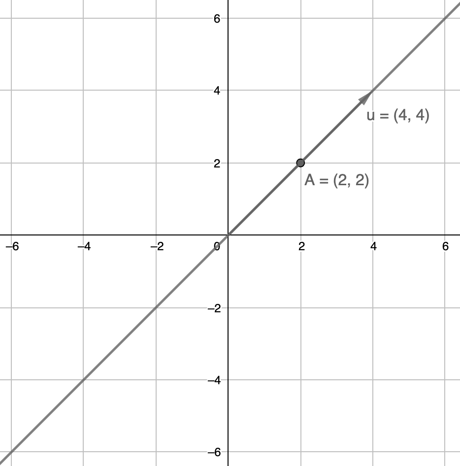
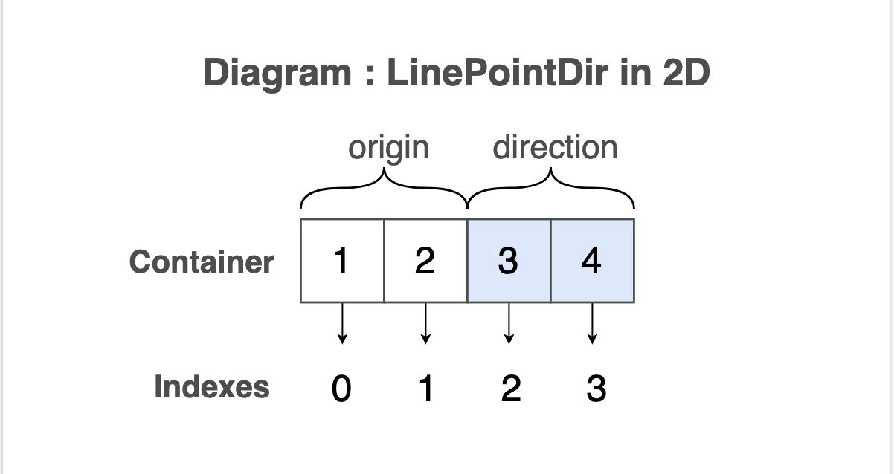

# Introduction

Стаття описує основні особливості модуля та принципи його використання.

<!-- ### Why?(later) -->

### Creating figures

Створення фігури із розмірністю визначеною за замовчуванням

```js
let sphere = _.sphere.make();
console.log( 'Sphere : ', sphere );
/* log : Sphere : [ 0, 0, 0, 0 ] */
```

Створення фігури із довільною розмірністю.

```js
let sphere = _.sphere.make( 2 );
console.log( 'Sphere : ', sphere );
/* log : Sphere : [ 0, 0, 0 ] */
```

### Keep flat, keep simple

"Плоский" формат представлення фігури означає те, що дані фігури зберігаються у одновимірному контейнері: масив, вектор, вектор адаптер.

Наступні приклади відносяться до двовимірної фігури типу `linePointDir` із даними: ```[ 2, 2, 4, 4 ]```

Візуалізація фігури:



Створення фігури на основі даних:

```js
let line = _.linePointDir.from( [ 2, 2, 4, 4 ] );
console.log( 'Line: ', line );
/* log : Line : [ 2, 2, 4, 4 ] */
```

Розміщення даних фігури в памяті процесу:



Приклад отримання даних фігури:

```js
//Отримання початкової точки лінії
let line = _.linePointDir.from( [ 2, 2, 4, 4 ] );
let origin = _.linePointDir.originGet( line );
console.log( 'Origin: ', origin.toStr() );
/* log : Origin : "2.000 2.000" */

//Отримання вектору напрямку
let line = _.linePointDir.from( [ 2, 2, 4, 4 ] );
let direction = _.linePointDir.directionGet( line );
console.log( 'Direction: ', direction.toStr() );
/* log : Origin : "4.000 4.000" */

```

### Isomorphic

Поведінка рутин залишається незмінною при зміні типу фігури.

Наприклад, рутина ```pointContains``` завжди виконує лише перевірку чи фігура містить точку.

```js

var point = [ 0, 1 ];

var plane = [ 0, 1, 1 ];
var contains = _.plane.pointContains( plane, point );
console.log( 'Plane contains point: ', contains );
/* log : Plane contains point: false */

var line = [ 0, 0, 0, 2 ];
var contains = _.linePointDir.pointContains( line, point );
console.log( 'Line contains point: ', contains );
/* log : Line contains point: true */

var polygon = _.convexPolygon.make( 2, 3 ).copy
([
  1, 0, 0,
  0, 0, 1
]);
var contains = _.convexPolygon.pointContains( polygon, point );
console.log( 'Polygon contains point: ', contains );
/* log : Polygon contains point: true */

```

### Intuivtive

Рутини маю інтуїтивні назви. Вміння користуватись однією рутиною дозволяє використовути інші рутини однієї категорії змінюючи лише префікс та другий вхідний аргумент( фігуру )

Приклад використання групи рутин *Intersects для перевірки перетину фігури типу
"plane" із іншими фігурами.

```js

var plane = [ 1, 0, 0, 1 ];

var box = [ 0, 0, 0, 1, 1, 1 ];
var got = _.plane.boxIntersects( plane, box );
console.log( 'Plane intersects with box: ', got )
/* log : Plane intersects with box:  */

var capsule = [ - 1, 2, 3, -1, 2, 3, 0  ]
var got = _.plane.capsuleIntersects( plane, capsule );
console.log( 'Plane intersects with capsule: ', got )
/* log : Plane intersects with capsule: true */

var frustum = _.Matrix.make( [ 4, 6 ] ).copy
([
  0,   0,   0,   0,  -1,   1,
  1,  -1,   0,   0,   0,   0,
  0,   0,   1,  -1,   0,   0,
 -1,   0,  -1,   0,   0,  -1
]);
var got = _.plane.frustumIntersects( plane, frustum );
console.log( 'Plane intersects with frustum: ', got )
/* log : Plane intersects with frustum: false */

var got = _.plane.planeIntersects( plane, plane );
console.log( 'Plane intersects with plane: ', got )
/* log : Plane intersects with plane: true */

var line = [ 1, 0, 1, 1, 1, 1 ]
var got = _.plane.lineIntersects( plane, line );
console.log( 'Plane intersects with line: ', got )
/* log : Plane intersects with line: true */

var segment = [ -2, -2, -2, 2, 2, 2 ]
var got = _.plane.segmentIntersects( plane, segment );
console.log( 'Plane intersects with segment: ', got )
/* log : Plane intersects with segment: true */

var sphere = [ 2, 0, 0, 1 ]
var got = _.plane.sphereIntersects( plane, sphere );
console.log( 'Plane intersects with sphere: ', got )
/* log : Plane intersects with sphere: false */

var ray = [ 0, 0, 0, 1, 1, 1  ]
var got = _.plane.rayIntersects( plane, ray );
console.log( 'Plane intersects with ray: ', got )
/* log : Plane intersects with ray: false */

```

<!-- ### Figures overview( later ) -->

  <!-- -- One sentence per figure + image -->

### Convention dst=null

Рутини, які очікують dst контейнер першим аргументом, можуть створювати новий інстанс фігури, для цього необхідно передати null в якості dst аргумента.

```js

var pointA = [ 3, 1, 3 ];
var pointB = [ 3, 8, 3 ];
var box = _.box.fromPoints( null, [ pointA, pointB ] );
console.log( 'Box: ', box );
/* log : Box: [ 3, 1, 3, 3, 8, 3 ] */

```

### Higher dimension

Одна рутина може виконувати операції для фігур різної розмірності( якщо такий випадок є реалізованим )

```js

var sphere2d = [ 1, 1, 5 ];
var point2d = [ 2, 2 ];
var got = _.sphere.pointContains( sphere2d, point2d );
console.log( 'Sphere contains point: ', got )
/* log : Sphere contains point: true */

var sphere3d = [ 2, 2, 2, 5 ];
var point3d = [ 3, 3, 3 ];
var got = _.sphere.pointContains( sphere3d, point3d );
console.log( 'Sphere contains point: ', got )
/* log : Sphere contains point: true */

var sphere4d = [ 3, 3, 3, 3, 5 ];
var point4d = [ 4, 4, 4, 4 ];
var box = _.sphere.pointContains( sphere4d, point4d );
console.log( 'Sphere contains point: ', got )
/* log : Sphere contains point: true */

```

### Alternative figures

Фігура може бути перетворена із однієї концептуальної форми в іншу.

Приклад перетворення фігури `linePoints` в `linePointDir` та обчислення точки перетину двох фігур.

```js
var linePoints1 = _.linePoints.from( [ 1, 1, 3, 3 ] );
var linePoints2 = _.linePoints.from( [ 2, 2, 3, 3 ] );
var point = _.linePoints.pairIntersectionPoint( linePoints1, linePoints2 );
console.log( 'Intersection point:', point );
/* log : Intersection point: */

var linePointsDir1 = _.linePointDir.fromPoints2( linePoints1 );
var linePointsDir2 = _.linePointDir.fromPoints2( linePoints2 );
var point = _.linePointDir.lineIntersectionPoint( linePointsDir1, linePointsDir2 );
console.log( 'Intersection point:', point );
/* log : Intersection point: */

```

### Summary


[Back to content](../README.md#Tutorials)
